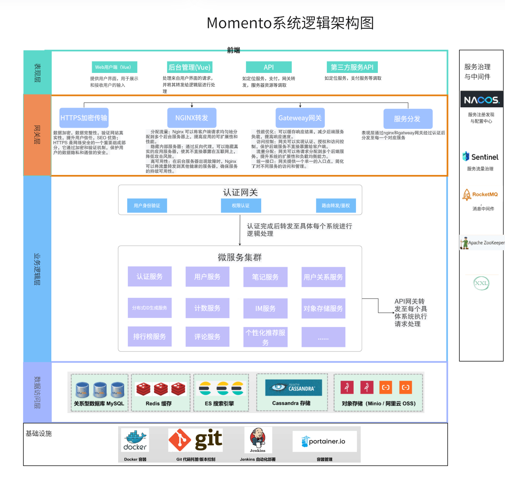
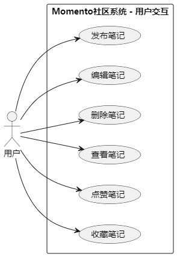
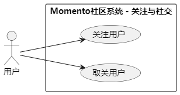
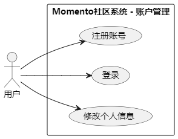
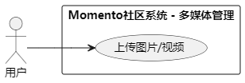

# **Project Proposal: Momento (Life Sharing and Social Interaction Platform)**

**项目成员：**

2250286 李俊旻

2254272 赵子毅

2253551 李沅衡

[TOC]

## 1. Project Overview

### 1.1 Background

With the rapid rise of social media and content platforms, users are increasingly relying on online platforms to share their lives, thoughts, and experiences. Particularly in the areas of content creation and community interaction, users are demanding greater personalization, real-time features, and high availability. At the same time, with the dramatic growth in user numbers, platforms must be capable of handling high-concurrency read and write requests to ensure real-time user response and data consistency.

### 1.2 Motivation

Current content-sharing and social platforms show significant shortcomings in addressing high-concurrency processing, personalized recommendations, user privacy protection, and data security. This project, through the adoption of an advanced distributed architecture and microservice design, aims to address these limitations by providing users with a more stable, efficient, and personalized content-sharing and social interaction platform.

### 1.3 Project Objectives and Scope

This project aims to build a content-sharing and social interaction platform that supports functionalities like publishing notes, liking, bookmarking, and following, meeting the high standards of user demands for social and content-sharing experiences. The project will adopt a microservice architecture to handle high concurrency from a large user base, ensuring the platform’s high availability and scalability. By implementing a distributed architecture, we aim to ensure data consistency and real-time responses while enhancing user experience through innovative community interaction methods. The project scope is clearly defined to ensure team members maintain a consistent understanding throughout the development process and to clarify project boundaries and deliverables.

#### 1.3.1 Project Goals

The core goal of Momento is to create an efficient content-sharing platform where users can post, interact, and share within a vast array of content. The platform will improve the user experience through support for high concurrency, data consistency, and personalized recommendations, ultimately achieving the following goals:

- Provide users with convenient note management and interaction features, building a multi-layered social network.
- Enhance user content discovery efficiency and engagement through personalized recommendations and search functionality.
- Ensure system stability and real-time data consistency under high concurrency.

#### 1.3.2 Project Deliverables

The Momento project will deliver the following core functional modules to meet platform requirements:

- **Note Management**: Allows users to publish, edit, and delete notes, with visibility options (e.g., public, friends only, private). It also supports pinning notes and organizing them with tags.
- **User Interaction**: Supports user operations such as liking, commenting, and bookmarking notes. The commenting feature will include multi-level replies to enhance the interaction experience.
- **User Relationships**: Enables following and unfollowing, helping users build a social network. Users can also view follower and following lists.
- **Notification Service**: Provides real-time notifications for user interactions (e.g., likes, comments, follows), ensuring users can stay updated on platform activities.
- **Authentication and Authorization**: Supports user registration, login, password management, and identity verification. JWT is used for authentication, and an RBAC model is implemented for authorization control.
- **Tags and Topics**: Users can add tags to notes and participate in topic discussions, promoting community engagement.
- **Content Recommendation**: Utilizes machine learning algorithms to offer personalized recommendations based on user behavior data, helping users discover content of interest.
- **Search Functionality**: Supports searching by keywords, tags, users, and topics, providing efficient content retrieval via Elasticsearch.
- **Admin Management System**: Provides tools for administrators to review and manage user content and monitor platform operations, ensuring compliance.
- **Distributed Storage and Caching**: Employs technologies like Redis, Minio, and Cassandra to ensure data storage and efficient caching in high-concurrency environments.

#### 1.3.3 Project Boundaries

To maintain focus, the development of the Momento platform will concentrate on the above core functionalities. The following aspects are excluded from the project scope:

- Integration with third-party social platforms.
- Support for live streaming and other media formats.
- Business extensions such as e-commerce or ad management features.

#### 1.3.4 Project Constraints and Assumptions

- **Constraints**: The platform must ensure high availability and data consistency, especially under large-scale user concurrency. Data privacy and security are top priorities, with all user interactions and data storage required to comply with relevant security standards.
- **Assumptions**: It is assumed that users seek to enhance platform interaction through personalized recommendations and real-time notifications. Additionally, it is assumed that the system can effectively handle high concurrency demands through its distributed architecture.

#### 1.3.5 Acceptance Criteria

To ensure successful project delivery, the acceptance criteria for the Momento project include:

- The core system functionalities must operate stably under high concurrency scenarios.
- Data consistency and real-time user interactions must meet expectations, with a smooth user experience.
- The system must be fully functional, with the admin management system effectively managing users and content.
- The project must pass performance testing and support the expected user volume.

#### 1.3.6 Scope Change Management

Any scope changes must be discussed and approved by the team before implementation. Scope changes will require updates to the project schedule, resource allocation, and other related documents to minimize the impact on the project.

## 2. Main Functionalities

### 2.1 Note and Comment Services

- Users can publish, edit, and delete notes with visibility settings (public, friends only, private).
- Supports a note-pinning feature to help users highlight important content.
- The comment service supports nested comments and multi-level replies, enabling users to interact with others through comments.

### 2.2 Like and Bookmark Services

- Users can like or unlike notes, as well as bookmark notes.
- Bookmarking supports categorized management, allowing users to organize bookmarked notes for easier management.
- Like and bookmark actions trigger related notification and counting services, ensuring accurate updates to user interaction data.

### 2.3 User Relationship Service

- Implements follow and unfollow actions between users and supports viewing followers and following lists.
- Changes in user relationships are synchronized with the recommendation service to adjust personalized recommendations.

### 2.4 Notification Service

- Sends real-time interaction notifications (e.g., likes, comments, follows) with support for real-time push notifications and batch messaging.
- Provides read/unread status management, allowing users to view unread and historical notifications.

### 2.5 Authentication Service

- Supports user registration, login, and password modification using JWT for authentication.
- Offers multiple login methods (e.g., phone verification code login, username/password login) and integrates Alibaba Cloud SMS service for sending verification codes.
- Utilizes SaToken for user permission and role control (RBAC), supporting different user permission operations.
- Provides strong password management and login protection features to ensure account security.

### 2.6 Tag and Topic Service

- Users can add multiple tags to notes for better categorization and content discovery.
- Supports the creation and participation in topic discussions. The platform can display trending topics to encourage community engagement.
- Tag and topic services are integrated with the search function, allowing users to find notes and topic content by keywords.

### 2.7 Content Recommendation Service

- Provides personalized recommendations using machine learning algorithms based on user behavior data (browsing history, likes, bookmarks, etc.).
- The recommendation service interacts with user relationships, likes, and bookmarks data to ensure the accuracy and timeliness of recommendations.

### 2.8 Search Service

- Users can search for notes, users, tags, and topics using keywords. The search service is powered by Elasticsearch for efficient full-text retrieval.
- Supports multi-condition searches, such as filtering notes by publication date, like count, etc., to help users find content of interest more precisely.
- Offers search support for administrators to locate notes that require review or removal.

### 2.9 Admin Management Service

- Administrators can review and manage user-published notes and comment content through the admin management system, as well as manage user account permissions.
- Provides data analytics functionality, allowing administrators to view key metrics such as user activity, interaction volume, and content publication counts.
- Supports the categorized review and handling of inappropriate content to ensure platform compliance and legality.

### 2.10 Distributed ID Generation Service

- Integrates Meituan’s Leaf distributed ID generation solution, providing high-performance segment ID and Snowflake algorithm ID generation to ensure the uniqueness of operations across the system.

### 2.11 Object Storage Service

- Responsible for storing user-uploaded images, videos, and other unstructured data, supporting Minio as the storage type.
- Uses factory and strategy patterns to extend storage types, ensuring flexibility in data storage.
- Combines with Nacos for distributed configuration management and dynamically registers storage strategies, supporting scalability across different environments.

### 2.12 Counting Service

- Tracks user interactions such as the number of likes, bookmarks, followers, and fans, ensuring the accuracy of data statistics in high concurrency scenarios.

## 3. Preliminary Logical Architecture

The Momento platform is designed based on a microservice architecture, leveraging the Spring Cloud Alibaba ecosystem for service governance, configuration management, and integration of features like rate limiting and circuit breakers. Services communicate via REST API, ensuring efficient data transmission and real-time operations. A message queue (RocketMQ) is used for asynchronous processing and decoupling, ensuring data consistency and system availability in high-concurrency scenarios.

### 3.1 Overall Logical Architecture Diagram

### 3.2 Presentation Layer

The presentation layer is responsible for interacting with users and mainly includes:

- **Web User Interface**: Developed using the Vue framework, it provides a desktop user interface, supporting user operations like note publishing, content viewing, and interactions.
- **Mobile Interface (if applicable)**: Developed using uni-app, it provides a mobile user interface, ensuring that users can conveniently access the platform through mobile devices.

The presentation layer distributes user requests to backend microservices through the **Nginx** reverse proxy server, offering front-end and back-end decoupling and load balancing to ensure reliable request distribution and fast access speeds.

### 3.3 Gateway Layer

The **Service Gateway Layer** uses **Spring Cloud Gateway** as a unified entry point for microservices and offers the following functions:

- **Request Routing and Load Balancing**: Routes user requests to the corresponding microservices, ensuring efficient distribution while supporting dynamic routing and canary releases (a gradual release strategy where new versions are rolled out to a subset of users to minimize risk and conduct stability testing).
- **Unified Authentication**: Uses **SaToken** for user authentication and authorization, parsing tokens and transmitting user information to downstream services, ensuring system security and the legality of user operations.

### 3.4 Business Logic Layer

The business logic layer consists of multiple microservice components managed by **Spring Cloud Alibaba**, with each service handling different business logic to ensure loose coupling and high scalability. The key services include:

- **Authentication Service**: Based on the RBAC (Role-Based Access Control) model, supporting user login authentication (JWT), registration, logout, password changes, ensuring the legitimacy of user identities.
- **User Service**: Manages user information, supports user information updates, queries, and registration, and uses **Redis + Caffeine** to build a two-level cache for high-concurrency access to user information.
- **Note Service**: Supports publishing, editing, querying, pinning, and permission modifications of notes. Uses **RocketMQ** for data broadcasting and cache updates to ensure data consistency (RocketMQ ensures consistent data updates across multiple nodes through asynchronous messaging) and leverages a two-level cache for high-concurrency read operations.
- **User Relationship Service**: Manages follow and unfollow actions between users, maintaining social relationships. It uses **Redis** caching and **message queues (MQ)** to handle high-concurrency write operations.
- **Counting Service**: Tracks user metrics such as followers, likes, and bookmarks. The service consumes user behavior data through message queues to ensure high performance and availability in high-concurrency scenarios. Message queues process user behavior data asynchronously, reducing the burden on the database and improving system throughput. Additionally, message queues offer persistence and retry mechanisms to ensure data reliability and availability in high-concurrency situations.
- **Distributed ID Generation Service**: Based on the **Meituan Leaf** project, provides unique identifiers for the system, supporting high-concurrency environments to prevent ID conflicts.
- **Object Storage Service**: Stores unstructured data such as images and videos, using a factory and strategy pattern to support **Minio** for flexible storage expansion.
- **KV Short Text Storage Service**: Based on **Apache Cassandra**, it stores short text content such as note bodies and comments, supporting high-concurrency read and write demands to ensure fast data access.

### 3.5 Data Access Layer

The data access layer consists of various databases and storage systems to meet different data requirements, ensuring data security, persistence, and efficient access:

- **MySQL**: Stores relational business data, providing transaction guarantees to ensure data consistency and durability.
- **Redis**: Used for caching frequently accessed data, significantly improving system response times and reducing database load.
- **Elasticsearch (ES)**: Used for full-text search and efficient data querying, supporting fast retrieval of note content and user data.
- **Apache Cassandra**: Used for storing short text data, supporting high-concurrency read and write demands, ensuring data access performance under large-scale user operations.
- **Object Storage (Minio)**: Used to store images, videos, and other unstructured data, ensuring the reliability and scalability of large-scale file storage.

### 3.6 Service Governance and Middleware Layer

The service governance and middleware layer manages services, monitoring, and message communication using the following tools to ensure high availability and system stability:

- **Nacos**: Used for service registration and configuration management, supporting dynamic configuration and service discovery to ensure high availability of microservices.
- **Sentinel**: Provides traffic control and circuit-breaking to protect system stability during peak traffic and prevent overload.
- **RocketMQ**: Used for asynchronous messaging, enabling loose coupling and efficient communication between microservices, ensuring data consistency and real-time processing.
- **ZooKeeper**: Coordinates tasks in distributed systems, ensuring consistency in distributed services and managing distributed locks and configurations.
- **XXL-JOB**: Handles scheduled tasks, supporting the execution and management of distributed tasks to ensure reliable task execution. For example, it can be used for regular data cleanup, cache synchronization, and generating statistical reports.

### 3.6 Infrastructure and DevOps Support Layer

The infrastructure and DevOps support layer adopts various tools to achieve automated system management, continuous integration, and delivery, enhancing system stability and development efficiency:

- **Docker**: Used for containerized deployment, ensuring the portability and environmental consistency of microservices, facilitating rapid scaling and operations.
- **Git**: Used for version control, managing code changes, supporting team collaboration, and ensuring versioning and traceability of code.
- **IntelliJ IDEA**: Primarily used for Java microservice development, offering robust debugging and code analysis features.
- **Visual Studio Code**: Used for front-end development and configuration file management, being lightweight and rich in plugins.
- **Maven**: A project build tool for managing dependencies and compiling and packaging applications.

## 4. Preliminary System Design

### 4.1 Use Case Diagrams

#### 4.1.1 Note Functionality Use Case Design

#### 4.1.2 User Relationship Use Case Diagram

#### 4.1.3 Personal Information Management Use Case Diagram

### 4.2 Activity Diagrams

#### 4.2.1 Authentication Service

Responsible for building and developing the authentication service based on the RBAC model, using SaToken to implement JWT-based user login authentication (supporting account login, phone verification code login), logout, self-registration, and password modification. Integrates with Alibaba Cloud SMS service, uses a custom thread pool for asynchronous phone number verification code sending, and prevents SMS interface abuse.

#### 4.2.2 User Service

Responsible for designing and implementing the user service, offering basic information management such as user profile updates, registration, query, and password updates (with BCrypt random salt encryption). Utilizes Redis + Caffeine local cache to build a two-level cache, providing high-concurrency read support for user queries and effectively preventing cache avalanche, penetration, and breakdown. 

#### 4.2.3 Note Service

Responsible for designing and implementing the note service, supporting users in publishing, editing, querying, pinning, and modifying note permissions. Uses CompletableFuture for concurrent downstream service calls to reduce response times. A two-level cache is implemented to support high-concurrency reads for note details. For updates and deletions, RocketMQ broadcasts messages to ensure cache consistency across clusters by invalidating local caches. The like feature supports high-concurrency writes using Redis Bloom filters to quickly check if a user has liked a note. Redis ZSET + MQ handles asynchronous database updates, while RateLimiter ensures traffic smoothing to prevent database overload.

#### 4.2.4 User Relationship Service

Responsible for designing and implementing the user relationship service. Follows and unfollows operations support high-concurrency write operations for managing user social relationships. Utilizes Redis caching and ordered message queues (MQ) for asynchronous database updates, ensuring high-concurrency writes and operation order. Lua scripts are employed to prevent Redis performance bottlenecks from frequent operations and ensure atomicity in multiple operations. Consumers use a composite unique index to guarantee idempotency of relationship records. Fan and follower list queries use Redis ZSET, with different strategies to cache hot data, supporting high-concurrency paginated read requests.

## 5. Candidate Development Technologies

- **Programming Language**:  
  - **Java**: For developing the core business logic, combined with the Spring Boot framework to provide efficient server-side capabilities.  
- **Microservices Framework**:  
  - **Spring Cloud Alibaba**: A complete set of microservice solutions including service registration, discovery, configuration management, rate limiting, and circuit breaking.
  - **Nacos**: Used for service discovery, configuration management, and dynamic DNS services.
  - **Spring Cloud Gateway**: Serves as an API gateway, handling request routing, load balancing, rate limiting, and authentication.
  - **OpenFeign**: Simplifies communication between services with HTTP client calls.
- **Databases**:  
  - **MySQL**: For persistent storage of relational data, ideal for business data like user and note information.
  - **Redis**: A distributed cache system that accelerates data access and alleviates database pressure, especially useful in high-concurrency scenarios like counting services and hot data.
  - **Cassandra**: For short-text data storage, supporting high-write and high-read demands, ensuring high availability in high-concurrency environments.
  - **Elasticsearch**: A full-text search engine used for efficient searching of notes, users, and topics.
- **Message Queue**:  
  - **RocketMQ**: For asynchronous communication and event-driven architecture, supporting high-throughput message publishing and subscribing, ensuring system decoupling and reliability.
- **Containerization**:  
  - **Docker**: For containerized deployment of services, ensuring consistency across development, testing, and production environments, facilitating rapid scaling and deployment.
  - **Kubernetes**: For container orchestration and management, enabling automated deployment, scaling, and management of services, enhancing platform availability.
- **Object Storage**:  
  - **Minio**: A lightweight distributed object storage solution that supports storing unstructured data like images and videos, compatible with AWS S3 API.
- **Search Engine**:  
  - **Elasticsearch**: For full-text search and efficient multi-dimensional queries, especially suitable for complex search needs such as notes, tags, and topics.
- **Distributed ID Generation**:  
  - **Meituan Leaf**: Provides segment ID generation and Snowflake ID generation to ensure globally unique identifiers and high performance in the system.
- **Authentication and Authorization**:  
  - **SaToken**: A lightweight authentication and authorization framework supporting JWT-based multi-terminal login, permission control, and annotation-based authorization, ensuring system security.
- **Development and Testing Tools**:  
  - **IntelliJ IDEA**: Mainly used for Java microservice development, offering powerful debugging and code analysis features.
  - **Visual Studio Code**: For front-end development and configuration file management, lightweight with rich plugins.
  - **Git**: For version control, supporting branch management and collaborative code development.
  - **Maven**: A project build tool that manages dependencies, compiles, and packages applications.
  - **Apifox**: For API interface testing, automated testing, and documentation generation, facilitating interface validation and debugging during development.

## 6. Middleware and Platforms

- **Middleware**:  
  - **Nacos**: Provides microservices registration, discovery, and dynamic configuration management to ensure automated service management and centralized configuration.
  - **Sentinel**: Provides traffic control, circuit-breaking, and system protection features to ensure system stability and availability under high concurrency.
  - **RocketMQ**: Supports high-concurrency, high-throughput message publishing and subscription, used for system decoupling, asynchronous processing, and event-driven architecture.
  - **Zipkin**: For distributed tracing in microservice systems, helping to monitor service invocation relationships and performance bottlenecks.
  - **Zookeeper**: Acts as a distributed coordination service, offering distributed lock management, leader election, and ensuring service consistency and coordination.

- **Platforms**:  
  - **Kubernetes**: A container orchestration platform that manages container deployment, scaling, and load balancing, ensuring service elasticity and automated management.
  - **Jenkins**: For continuous integration and deployment (CI/CD), ensuring automated code building, testing, and deployment.
  - **Prometheus**: An open-source monitoring system used to collect performance metrics from services and monitor service health.
  - **Grafana**: Works with Prometheus to visualize monitoring data, helping with system performance tuning and troubleshooting.
  - **Docker Registry**: Stores and distributes Docker images, ensuring version management and security of the images.

## 7. Project Schedule

- **Week 8-9**: Architecture design and technical validation, complete microservices decomposition, and detailed task assignment.
- **Week 10-13**: Core functionality development, including note, user relationship, like and bookmark, tag, and topic services.
- **Week 14-15**: Service integration, ensuring system availability and correctness, followed by system integration testing.
- **Week 16**: System testing and performance optimization, addressing concurrency issues and data consistency, conducting stress tests and performance tuning.
- **Week 17**: Prepare demonstration materials and final documentation, complete project summary and presentation, and conduct project acceptance.

## 8. Project Highlights

The Momento project aims to create an innovative content-sharing and social interaction platform that addresses current platforms' challenges in handling high concurrency, personalized recommendations, and user privacy protection. Based on advanced microservice architecture and distributed design, Momento will provide a stable, efficient social experience that meets users' personalized needs. The platform not only focuses on the convenience of community interaction and content creation but also emphasizes high availability and data consistency, ensuring that users can enjoy smooth interactions anytime.

Momento’s key features include high scalability, availability, flexible deployment, data consistency, and personalized content recommendations. Through these features, we aim to provide users with more than just a social platform—Momento is envisioned as a vibrant community driven by interests. By combining machine learning-powered recommendation systems, flexible tag and topic functionalities, and innovative multi-level caching architecture, we aim to connect users with content more intelligently.

Our vision is to make Momento an indispensable part of users' daily lives, where every share and interaction holds value and meaning.

